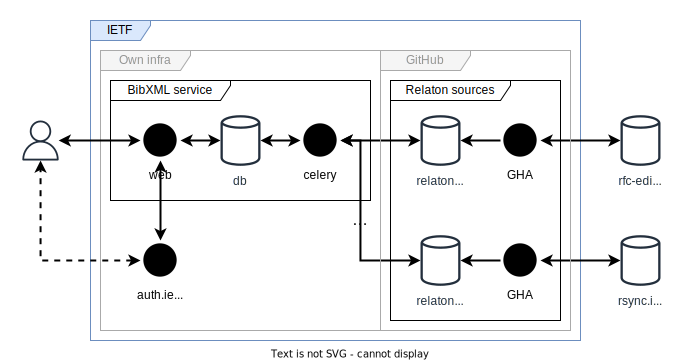

============
Architecture
============

Dependency overview
===================

       A diagram describing dependencies between
       services and data sources, under and outside of IETF control.

Basic entities
==============

The two most important entities operated upon by the service are:

1. Indexed :term:`reference`.

   Contains partial (e.g., without fully resolved relations)
   or full representation of a bibliographic item.

   Uniquely identified by source and own ID within the source.

2. :term:`Bibliographic item`.

   A “hydrated” bibliographic item displayed by the service,
   constructed from (possibly multiple) indexed references.

   These are fuzzily identified by a :term:`primary resource identifier`.

   .. note::

      Currently bibliographic items are constructed from indexed references
      on the fly, but as a further optimization measure the service may
      start constructing bibliographic items and storing them in the database
      for faster access.

Data sources
============

BibXML service relies on indexable
:term:`bibliographic data sources <bibliographic data source>`
configured (registered).
From those sources, BibXML service obtains bibliographic data
in the Relaton YAML format and indexes it for search purposes.
Indexing can be triggered either via management GUI or via API.

Those sources themselves are Git repositories,
the contents of which are in some cases static snapshots
but typically are generated periodically using respective
Github Actions workflows, which retrieve and parse bibliographic data
from authoritative sources and output it formatted consistently
per the Relaton data model.

.. seealso::

   * For a full list of Relaton datasets and how they are generated:
     https://github.com/ietf-tools/bibxml-service/wiki/Data-sources

   * For where Relaton sources are registered, :mod:`main.sources`

For :doc:`/topics/xml2rfc-compat` functionality,
BibXML service requires an additional indexable source (not pictured above)
that contains xml2rfc paths and associated XML data.
This source is used for xml2rfc path resolution fallback functionality.
Indexing can be triggered the same way as for bibliographic data sources.

.. seealso::

   * For where the xml2rfc archive source is registered,
     :mod:`xml2rfc_compat.source`

The role of the database
========================

The PostgreSQL database that is part of the service does not contain
critical data, losing all data would only require reindexing
the above bibliographic data sources.
